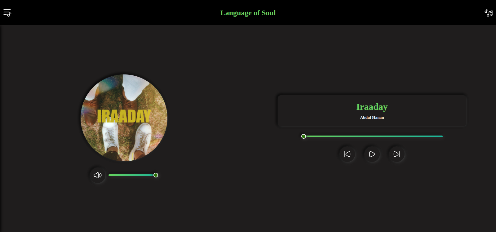

# 🎵 Music Player

A simple and modern **Music Player** built with **HTML**, **CSS**, and **JavaScript**.  
This project lets users listen to audio tracks with basic controls inside a clean and responsive interface.

---

## ✨ Features
- Play, pause, next, and previous track controls  
- Progress bar with seek functionality  
- Volume control  
- Displays song name, artist, and cover image  
- Fully responsive UI  
- Smooth animations and clean layout  

---

## 🛠️ Technologies Used
- **HTML** – Structure of the player  
- **CSS** – Styling, layout, and animations  
- **JavaScript** – Music controls and functionality  

---

## 📂 How to Use
1. Clone or download the repository  
2. Place your audio files inside the `music/` folder  
3. Update the song list in the JavaScript file if needed  
4. Open `index.html` in your browser  
5. Enjoy your music 🎧  

---

## 📸 Screenshots

---

## 🔗 Live Preview
**Live Preview:** [Click Here](https://techabby.github.io/codealpha_task2/)  

---

## 📜 License
This project is free to use for learning and personal projects.
